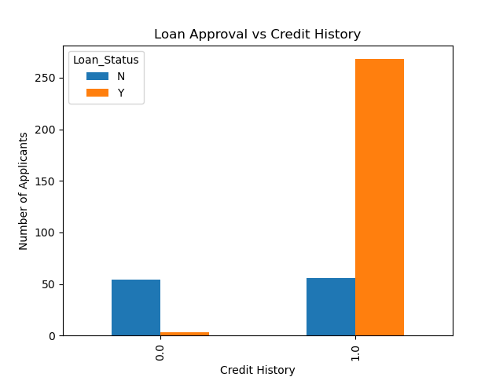
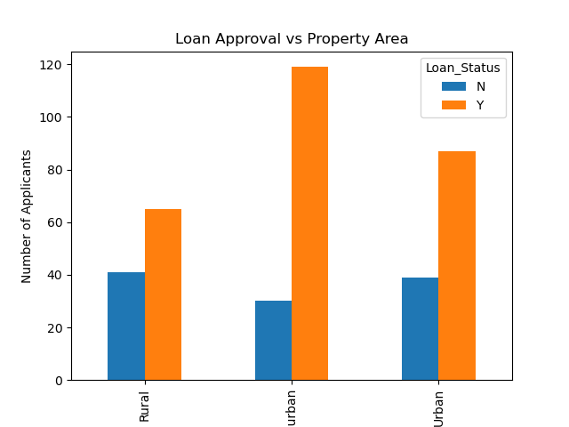

# Bank Loan Risk Analysis using Python and SQL

## 1. Project Overview

Banks receive a large number of loan applications, but approving loans involves financial risk.
This project analyzes loan applicant data to understand **which factors influence loan approval** and how applicants can be **segmented based on risk levels**.

The analysis is performed using **Python for data cleaning, analysis, and visualization**, and **SQL for structured querying and business-level insights**.

---

## 2. Business Problem Statement

Loan approval decisions are critical for banks, as incorrect approvals can lead to financial losses while overly strict policies can reduce business opportunities.

This project aims to answer the following business questions:

* Which applicant attributes have the strongest influence on loan approval?
* Does income alone determine loan approval decisions?
* How does credit history affect approval outcomes?
* Can applicants be segmented into **Low**, **Medium**, and **High** risk categories?
* How can risk segmentation help banks make more informed loan approval decisions?

By addressing these questions, the project demonstrates how data-driven analysis can support better risk assessment in the banking domain.

---

## 4. Dataset Description

The dataset used in this project was sourced from **Kaggle** and contains historical loan application records.

**Dataset highlights:**

* ~380 loan applications
* Each row represents a single loan applicant
* Mix of numerical and categorical features

**Key features include:**

* ApplicantIncome, CoapplicantIncome
* LoanAmount, Loan_Amount_Term
* Credit_History
* Property_Area
* Loan_Status (Approved / Rejected)

The dataset provides sufficient information to analyze approval patterns and to build rule-based risk segmentation for loan applicants.

---

## 5. Tools & Technologies

The following tools and technologies were used in this project:

* **Python**

  * Pandas (data cleaning and analysis)
  * NumPy (numerical operations)
* **Jupyter Notebook** (interactive analysis and experimentation)
* **MySQL** (data storage and SQL-based analysis)
* **MySQL Workbench** (database management and querying)

---

## 6. Project Workflow / Methodology

The project was carried out using a structured, step-by-step analytical approach:

1. **Data Loading**

   * Loaded the loan dataset into Python using Pandas for initial exploration.

2. **Data Cleaning & Preprocessing**

   * Identified missing values using `info()` and `isnull()`.
   * Filled numerical missing values using median.
   * Filled categorical missing values using mode.

3. **Exploratory Data Analysis (EDA)**

   * Analyzed loan approval distribution.
   * Studied relationships between loan status and key factors such as income, credit history, and property area.

4. **Risk Segmentation**

   * Segmented applicants into **Low**, **Medium**, and **High** risk categories based on income and credit history.

5. **Visualization**

   * Created bar charts using Pandas and Matplotlib to visualize:

     * Loan approval vs Credit History
     * Loan approval vs Property Area
     * Loan approval vs Risk Level
## 📈 Visualizations

### Loan Approval vs Credit History

### Loan Approval vs Property Area

6. **SQL Integration**

   * Stored the cleaned and enriched dataset in MySQL.
   * Performed SQL queries to calculate approval rates, average income, and risk-wise statistics.

This workflow ensured that the analysis remained systematic, reproducible, and aligned with real-world business decision-making.

---

## 7. Key Insights & Findings

Based on the Python analysis and SQL queries, the following key insights were derived:

* **Credit history is the strongest factor influencing loan approval**. Applicants with a good credit history have a significantly higher approval rate compared to those without.

* **Income alone does not determine loan approval**. Approved and rejected applicants show overlapping income ranges, indicating that banks consider multiple factors beyond income.

* **Risk segmentation provides clear separation in approval outcomes**:

  * High Risk applicants have a very low approval rate.
  * Medium Risk and Low Risk applicants show substantially higher approval rates.

* **Property area impacts loan approval trends**. Semiurban applicants have higher approval rates compared to rural areas, suggesting differences in financial stability and loan purposes.

* **Combining multiple factors leads to better risk assessment**. Using credit history, income patterns, and demographic factors together provides more reliable decision-making than relying on a single attribute.

These insights demonstrate how data-driven analysis can support banks in reducing default risk while maintaining healthy loan approval rates.

---

## 8. Conclusion

This project demonstrates how combining **Python-based data analysis** with **SQL-driven querying** can help banks make more informed loan approval decisions.

By analyzing multiple factors such as credit history, income patterns, risk levels, and property area, the study shows that **loan approval should be based on holistic risk assessment rather than a single attribute**.

The project highlights the importance of data-driven decision-making in reducing default risk while maintaining sustainable lending practices.
